```{r setup, include=FALSE}
knitr::opts_chunk$set(echo = FALSE)
```

# 1.0 Crtique of Original Data Visualization


The above data visualisation is obtained from the Department of Statistics, Singapore, [Singapore International Trade](https://www.singstat.gov.sg/modules/infographics/singapore-international-trade) website.


### 1.1 Clarity
Critique|Suggestion
----------|-----------
1) The chart only shows the 2020 net import and export value. It does not show the value per month which is of more importance to display whether there is growth or decline in trades by comparing with the preceding month. There is no control to allow readers to visualize the increase or decrease of trade between each country per month.| **A suggestion is to have a control panel to allow user to select the month & year with added animation to visualize the growth or decline from the preceding month.**
2) The chart does not accurately represent what was stated in the caption/sub-title.The caption stated that **"Since 2009, the value of exports exceeds imports for Singapore's merchandise trade with Mainland China.In comparison, the value of imports exceeds exports for Singapore's trade with United States since 2006."** However, the chart shows the 2020 overall trade with Singapore instead of showing what was stated in the caption.| **Similar to the suggestion in 1), a control panel will allow readers to better visualize the amount of trade from month to month which will make more sense on the caption given.**
3) The white dot in the middle of each dot displayed in the chart requires the reader to read before understanding the rationale for it. Additionally, the white dot for those that falls near the x-y axis line will not give the readers a clear picture of whether the export is more than the import or vice versa since the dot covers the 45 degree reference line.| **A clearer chart by 1. removing the white dot, 2. making the dots more transparent and 3. making the line more visible by thickening the line will allow readers to instantly understand the chart.**
4) The label for each country only displays the net amount for 2020. It does not display any other useful information such as balance of trade, %trade surplus/trade deficit.| **A suggestion is to deploy tooltip for every country displayed on the chart with useful information so that readers 1. do not need to reference to the scale to determine the value and 2. able to visualize more useful information.**
5) The overlapped markers make it difficult for readers to visualize the real size of the marker. Although the marker was highlighted when the cursor was moved onto it, it does not allow the reader to visualize instantly.Additionally, the 45 degree reference line was covered by the markers making it difficult for readers to visualize whether import is more than export or vice versa.| **A suggestion is create transparency on the markers to allow readers to better visualize the marker and also the 45 degree reference line.**
6) The bottom import and export scale label does not reflect well on which scale is import and export. | **Both label should be in the middle of the scale to allow readers to clearly understand the meaning of each scale better.**
7) The animation of the chart does only to move the marker at its own position making it zooming in and out a bit. This animation does not have any value.| **A suggestion will be to allow readers to click onto each marker and a tooltip can pop up to show the import and export value. Additionally, animation can help to reader to visualize the movement of the marker from one month to another month.**

### 1.2 Aesthetic
Critique|Suggestion
----------|-----------
1) The import and export symbol does not reflect well on the meaning of the symbol. | **A suggestion is to remove the symbol completely to avoid any confusion among the readers.**
2) Some of the labels are covered by other labels or the markers which make it physically unpleasant looking.| **Labels should not be covered by the markers or another label to allow readers to visualize the label more pleasantly.**
3) BLue and green does not constrast well with each other.| **A suggestion is to use blue and red instead for colour contrast.**
4) The label for China is out of the chart which makes it unpleasant for readers to visualize.| **A suggestion is to have all markers and labels located inside the chart.**
5) As there are too many variables of interest, the huge labels make the whole chart looks cluttered.| **A suggestion is to have smaller labels or incorporate a legend to make the chart less cluttered.**


# 2.0 Proposed data visualisation design


1) The proposed design incorporate a clean design with available filter and animation for better user experience and analysis. The proposed design seeks to allow the user to visualize 

  1.1) the Total trading value of Singapore with regards to its Trade of Balance. The further the markers move beyond the reference line, the higher percentage of trade surplus or deficit from Singapore. 
  
  1.2) The Balance of Trade in regards to trade surplus or deficit percentage. The further the markers are from the two zero lines, the higher the trade surplus or deficit. To have a sustainable economy, a country would like to acheive a darker blue which is as far away from the zero line as possible.
  
  1.3) The Import Vs Export where users are able to visualise the gradients between the import and export of a certain country. Similar to both 1.1 and 1.2, a country would like to achieve higher exports vs lower imports which will produce a dark blue line.

### 2.1 Clarity
Critique|Proposed improvements
----------|-----------
1) The chart only shows the 2020 net import and export value. It does not show the value per month which is of more importance to display whether there is growth or decline in trades by comparing with the preceding month. There is no control to allow readers to visualize the increase or decrease of trade between each country per month.| **The proposed visualisation incorporated a control panel where readers are able to choose the month year of interest and at the same time select the countries of interest.**
2) The chart does not accurately represent what was stated in the caption/sub-title.The caption stated that **"Since 2009, the value of exports exceeds imports for Singapore's merchandise trade with Mainland China.In comparison, the value of imports exceeds exports for Singapore's trade with United States since 2006."** However, the chart shows the 2020 overall trade with Singapore instead of showing what was stated in the caption.| **Instead of having a caption, the control panel do a better job in allowing users to visualize what is represented in the chart.**
3) The white dot in the middle of each dot displayed in the chart requires the reader to read before understanding the rationale for it. Additionally, the white dot for those that falls near the x-y axis line will not give the readers a clear picture of whether the export is more than the import or vice versa since the dot covers the 45 degree reference line.| **The proposed visualisation incorporate a bold and thicker reference line. Additonally, the markers will be displayed with a certain transparency with borders to show the accurate position of the markers.**
4) The label for each country only displays the net amount for 2020. It does not display any other useful information such as balance of trade, %trade surplus/trade deficit.|**Tooltip will be deployed with useful information such as balance of trade etc.**
5) The overlapped markers make it difficult for readers to visualize the real size of the marker. Although the marker was highlighted when the cursor was moved onto it, it does not allow the reader to visualize instantly.Additionally, the 45 degree reference line was covered by the markers making it difficult for readers to visualize whether import is more than export or vice versa.| **Same as 3), the markers will be filled with certain transparency and the 45 degree reference line will be thicken with darker colors.**
6) The bottom import and export scale label does not reflect well on which scale is import and export. | **All labels will be situated in the middle of the axis to allow user to visualise more easily.**
7) The animation of the chart does only to move the marker at its own position making it zooming in and out a bit. This animation does not have any value.| **Proper animation will be incorporated into the chart to allow users to see the movement of the markers when they switch from month to month and country to country.**

### 2.2 Aesthetic
Critique|Proposed Improvements
----------|-----------
1) The import and export symbol does not reflect well on the meaning of the symbol. | **The proposed visualisation will not incorporate any symbols that does not reflect well on the meaning of the symbol.**
2) Some of the labels are covered by other labels or the markers which make it physically unpleasant looking.| **Tooltip and smaller labels will be use instead of large physical labels.**
3) Blue and green does not constrast well with each other.| **Blue and Red will be use to differentiate between the markers**
4) The label for China is out of the chart which makes it unpleasant for readers to visualize.| **All markers and labels will be within the chart to make it aesthetically beautiful.**
5) As there are too many variables of interest, the huge labels make the whole chart looks cluttered.| **The proposed design will heavily make use of tooltips with possible small labels.**

# 3.0 Data Visualisation

The completed data visualisation using tableau desktop can be accessed through [**here**](https://public.tableau.com/app/profile/chee.hong/viz/SingaporeMerchandiseTradeJan2011-Dec2020/Dashboard1). Do note to select full screen to have better visibility of the chart.


# 4.0 Step-by-step data visualisation process

### 4.1 Data Preparation

1. Download and open the excel file downloaded from the sub-section of [**Merchandise Trade by Region/Market**](https://www.singstat.gov.sg/find-data/search-by-theme/trade-and-investment/merchandise-trade/latest-data) provided by the Department of Statistic, Singapore (DOS).


2. Notice that the above excel sheet has the **Subject, Topic and Title** on the first three row which is not required in our dataset. As such, we will move the main datasets from row 6 up to the first row. Additionally, we will also rename the sheet "T1" to "Imports" and "T2" to "Exports"


3. Next, for better visibility, we will hide those months that are not required on the instruction and only show data from Jan 2011 to Dec 2020.


4(a). If we give the datasets a look, we will be able to see that most of the countries are in **Thousand Dollars**. However, the region data **as highlighted below** is in **Million Dollars**. 


4(b). As such, we will create six new rows (**rows 122 to 137** )at the bottom of the original datasets to modify the region data to **Thousand Dollars**. First, we will create a dummy number, **1000** at **cell PF132**.
Next, at the first cell (**row PF122**) of the modified dataset, input the formula **PF3*$PF$132**. Lastly, drag the formularize cell to the last **cell TU127**


5(a). Next, notice that the number of the modified dataset is in text datatype. We will change the modified to number with commas in between to be consistent with the rest of the original data.


5(b). The end result should look like the below image. 


6. Repeat the same process for the **Exports** sheet and save the excel file to an appropriate name such as **Singapore Merchandise Trade**.

7. Next, we will open up Tableau Prep Builder and connect to our data.


8. A panel should emerge. Click the Microsoft Excel on the connect panel and search and access the previously modified Excel file. 


9. Once connected. The table pane will show up the sheets that was in the excel file. Drag the **Imports**sheet to the working diagram as shown.


10(a). An imports panel should show up as shown below.


10(b). Select out the months **(Jan 2011 to Dec 2020)** that was within the instructions given. Then click onto the **Add a clean step**.


11(a). Next, the clean process panel should show up. Click onto the button **(Show Data Grid)** beside the search box as shown. Click on the highlighted top rows which is in **Million Dollars** by pressing Ctrl on your keyboard and click all the **Million Dollars** rows. Then, proceed to click the **Exclude** button as shown. This process should remove the rows from your dataset. 

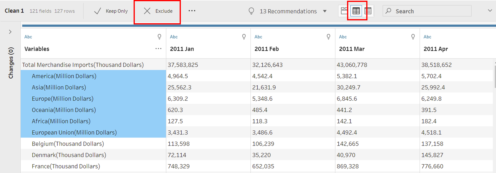

11(b). Next, we will also exclude the bottom rows which include the information of the dataset by doing the same step as above.


12(a). Next, we will change back to the **Profile Pane** by clicking on the button below. We will see that there are some na values. We should not exclude that as once we exclude the na values, the whole row will be removed. This will also removed other values within the row. Instead we will change it to **0** for all **na values**. However, to do that in Tableau Prep Builder, we will be required to change each individual field. To expedite the process, we will head back to our modified dataset in excel and replace the **na values** with **0**.


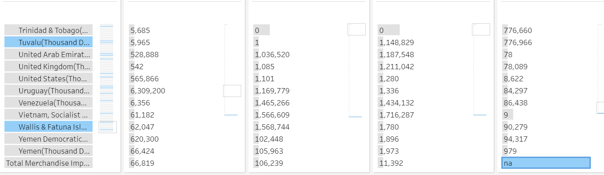

12(b). To replace all **na values** to **0** in excel. We will need to select the **Find & Select** under the **Home** tab. Next, we will need to replace the **na values** with **0** as shown below. All the **na values** should have change to **0**.


13. Next, we will head back to Tableau Prep Builder and refresh the modified data by clicking on the refresh button on the top of the page.


14(a). Next, we will see that there are some extra spaces under the **Variables** field in our dataset as shown below.

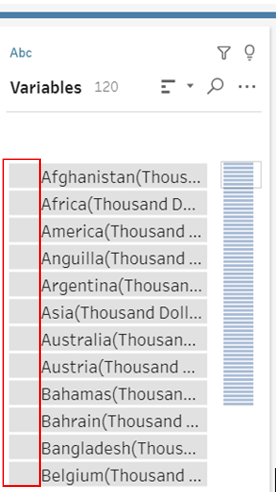

14(b). We will remove those extra spaces by doing the following as shown below.


15. Next, notice that there are two different total merchandise rows. One is Total Merchandise Imports(Thousand Dollars) the other is Total Merchandise Exports(Thousand Dollars). For us to be able to join this two rows successfully later in Tableau Desktop. We will remove the Imports and Exports from this two rows by renaming them into Total Merchandise Trade(Thousand Dollars).


16(a). After we have completed the cleaning process. We will pivot our data.This process ensure that certain field is required to be transform from columns to rows for certain data visualization outcome.

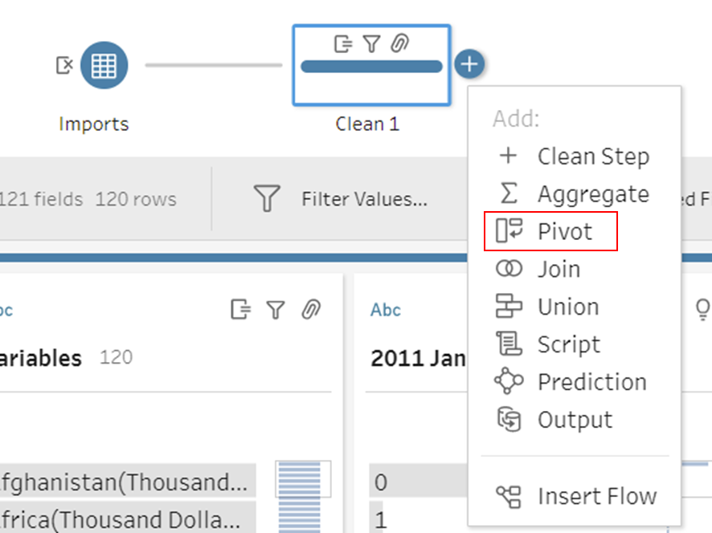

16(b). In our case, we want to change our month from columns into rows to ensure that each value is tag to each month from each country. Below is the process, we will drag all the months by clicking on the **2011 Jan** while holding **shift** and click again on **2020 Dec** and dragging it into the **Pivoted Fields** pane.


17(a). Next, we will rename the fields after pivoting. The original are shown below. 


17(b). We will rename the **“Pivot1 Names”** and **“Pivot1 Values”** to **“Year/Month”** and **“Import Values”** respectively


18(a). Lastly, we will export out our cleaned dataset to csv file. First, we will select the output button by clicking on the **+** button on the pivot block as shown below.


18(b). Next, we will output our file as a csv file by the same selection below and click **run flow**.


19. We will do the same process for the **"Exports"** sheet. The whole preparation process should look like this below.


### 4.2 Further Data Preparation in Tableau Desktop

1. We will now open Tableau Desktop and connect our csv data by clicking the **More...** under the **To a File** tab.


2. Next, we will click on the **Imports** file that we have prepared. Tableau should automatically list the file onto the **Logical Table** pane as shown below.


3(a). We will next drag the **Exports** file into the logical table as shown below.


3(b). A **Edit Relationship** should pop up. Select both **Variables** and **Variables (Exports.csv)** and click **close**. Remember that we need to join Month/Year to fully connect both data together.


3(c). Next, we will select the **Add more fields** tab.


3(d). Lastly, we will select both **Year/Month** and **Year/Month (Exports.csv)** as shown below and click the **x** button on the top right of the pane.


4.Next, notice that the datatype for **Year/Month** is in the text form. Change it to the **Date** form by clicking on the datatype button as shown below.


5. The **Variables** field is filled with **Countries(Thousand Dollars)**. As we only require the countries, we shal create a new field with only the countries in it by splitting. Click on the small downwards button on the top right of **Variables** and select split. A new field should show up.


6. Rename the split field to **Country/Region** by double clicking on the split field title.


7. Do the same for **Exports** sheet and rename the split field to **Country/Regions** as there cannot be two same field names from different sheets.

8. Once, we have join our dataset. We will switch to **Sheet 1** by clicking on the tab below the screen.


### 4.3 Singapore Merchandise Trade

9. Next, we will create a **Total Merchandise Trade** chart with certain details of Balance of Trade. First, we will drag the **Export Values** to the Columns and **Import Values** to the Rows as shown below.


10. Next, we will drag the **Country/Regions** to the **Detail** box under the **Marks** pane. This will shows all the countries and regions in the scatterplot.


11(a). Next, we will create a **Total Trading Value** field by selecting the **Create Calculated Field** under the **Analysis** tab. This new field will add up both exports and imports value.


11(b). Input the formula below to create the **Total Trading Value** field.


12. Next, we will create another new field called **%Surplus/Deficit**. This field will allow us to see the percentage surplus or deficit of a country on a certain period.


13. After the field has been created. We will drag it to the **Color** box on the **Marks** pane. Tableau will then show colour representation of each country based on their **%Surplus/Deficit**.


14. Next, we will select the circle symbol from the **Marks** pane to change the ""ring plot"" to scatterplot.


15(a). Next, we will see that there is a **null** notification at the bottom right of the chart. The reason for this is because there are more imports countries than exports countries. We are able to remove this by selecting **All Records Match** under the **Edit Relationship** in the **Data Source** panel as shown below. However, this will completely remove those countries that are in **Imports** sheet but not in **Exports** sheet which might lose useful information.


15(b). As such, we will move all these null data to the default position of **0**.


16(a). Next, we will drag the **Country/Regions** to the filter tab to allow user to select the ** Month Year** that they would like to visualize. For starters, we will select all the countries and regions **(This can be deselected later depends on user input)**.


16(b). Once we have selected all the countries and regions. Click **Apply** and **Ok**. Next, we will click on the triangular button beside the Country/Regions tab under filter and click **Show Filter**. The filter should show up at the right side of the screen.


17(a). Next, we will do the same for the Year/Month tab to allow user to select the month they want to visualize. 


17(b). This time round. There is no need to select all the month as we will be changing to single selection afterwards. We shall just click **Apply** and **Ok**.


17(c). Same as the previous filter. We will show the filter. Then click on the triangular button on the Year/Month filter and select **Single Value (slider). This will allow the user to slide to the month that they want or even by clicking left and right on the slider to switch to the previous or next month.


18(a). Next, we will see that there is a color legend of the **SUM(%Surplus/Deficit)** below our filters. Click on the triangular button and select **Edit Colors**. We would like to modify our colours to distinguish between surplus and deficit markers.


18(b). To better distinguish between surplus and deficit, we will choose **Red-Blue Diverging** from the dropdown selection.


18(c). Next, select the **Use Full Color Range** option to allow tableau to use the most extreme red and blue in regardless of the difference in value.


19. After we have selected. Head towards the **Country/Regions** and select the following countries. **Japan, Republic of Korea, Mainland China, Malaysia, United States, Taiwan, Thailand and Indonesia**. Selecting a few countries will allow us to see the visualisation better.

20(a). Notice that the markers are small in size. We shall enlarge the markers by adjusting the **Size** option under the **Marks** pane.

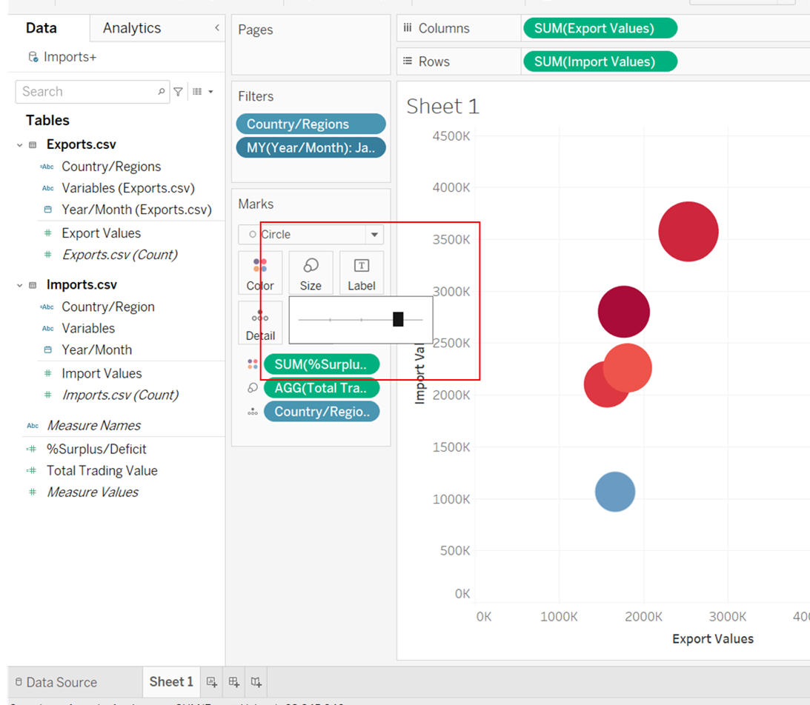

20(b). Next, notice that some of the markers border are not easily seen due to being covered by other markers. As such, we will colourise the border by selecting a light grey color to further distinguish the markers.


20(c). Next, we will change the transparency of the markers to further distinguish those markers being covered by other markers. The transparency of the markers will allow user to see the full circular markers.


21(a). Next, we will see that on the **%Surplus/Deficit** colour legend on the bottom right of the page is in decimals. We will change that by going to the SUM(%Surplus/Deficit) and select format by clicking on the triangular button. 
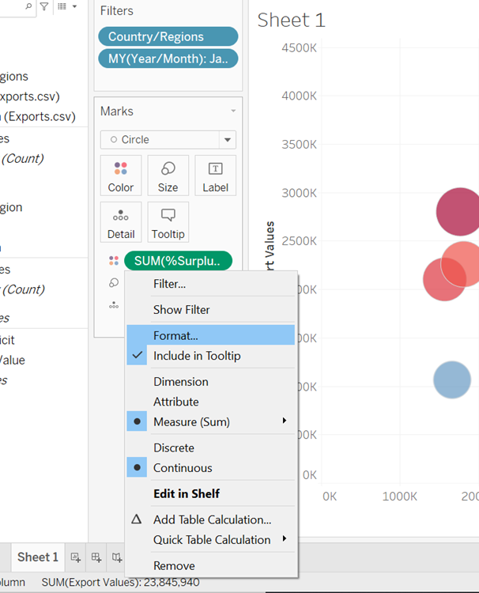


22. Switch to the **Pane** selection on the format panel. Under the Default section, change the Numbers to **Percentage** and select **0 decimal place**.

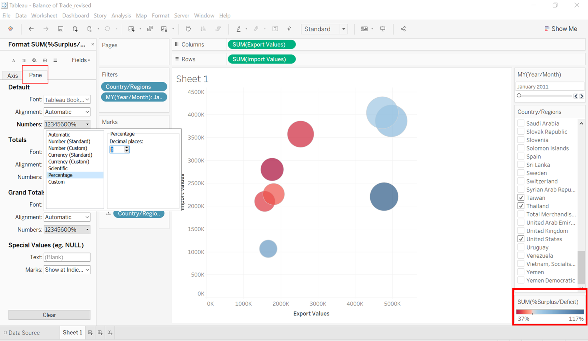

23. Next, we will change the chart size from **Standard** to **Entire View** to visualize the chart better.


24. To distinguish between Surplus or Deficit Marker. We will incorporate a 45 degree reference line. To make a reference line, we will create a new calculated field named **Reference Line** and input the formula **[Export Values]**


25. Next, we will drag the newly created field to the **Rows** section. Notice that a new chart with diagonal markers has been created below the original chart.


26. Next, we will perform a dual axis by clicking on the triangular button on the SUM(Reference Line) tab. This will ensure the diagonal markers is located with the original chart.


27. Notice that both axis are not of equal scale. we will do a synchronisation of the axis. By right clicking on the reference line scale and select **Synchronise Axis**. 


28. Next, we will remove the scale by deselecting the **Show Header** on the reference line scale option.

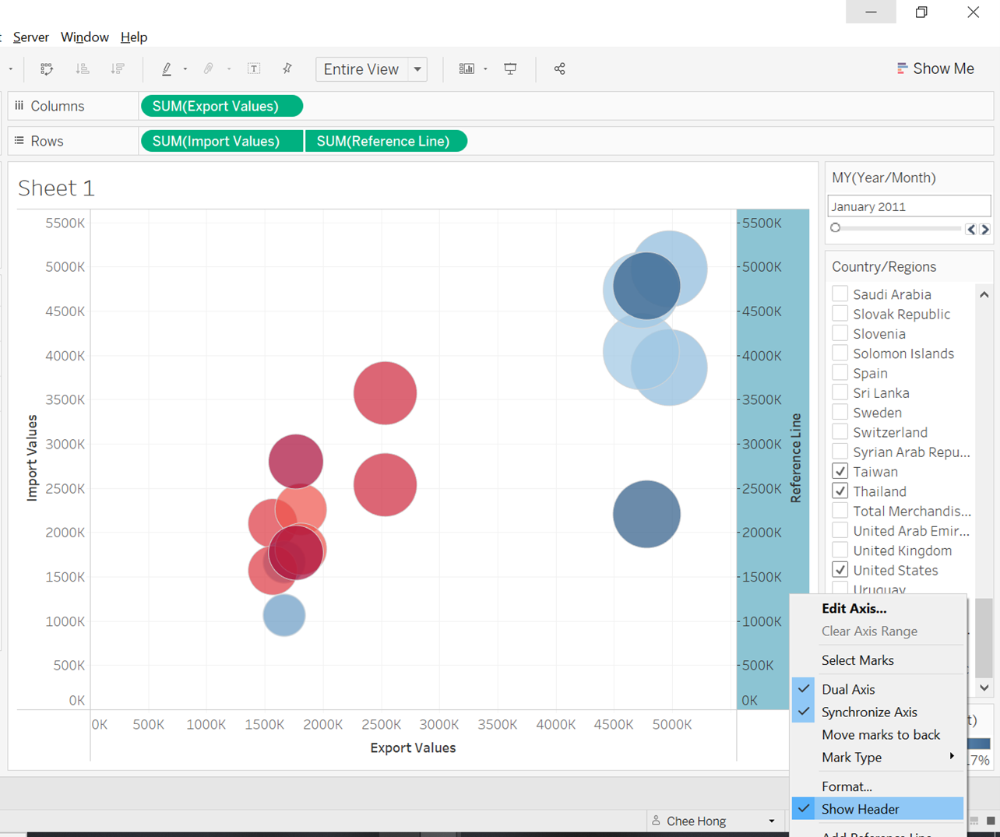

29. Afterwhich, we will head towards the **SUM(Reference Line)** section under the **Marks** pane and change the design of the chart to **line**. You will notice that tableau will try to line up the reference line markers diagonally.


30(a). To make the dotted reference line, we will right click on the reference marker on the chart and select trend line. 


30(b). A trend line should appear cutting diagonally along the chart.


31. Next, we will drag the **Country/Regions** to the **Label** under the **SUM(Import Values)** in the **Marks** pane to show each selected country as label.


32. The label is in black color. To distinguish the label with the marker, we will right click on the Label box and under font, we will select **Match Mark Color**.


33(a). Once, we are done with the design of the **Total Merchandise Trade** chart. We will move to **Sheet 2**. The purpose of **Sheet 2** is to create a small **Balance of Trade** chart that will be incorporated into the **Tooltip** of the **Total Merchandise Trade** chart that we have previously developed. 

33(b). We will create a new calculated field for **Balance of Trade** by input the below formula.


34. Next, we will drag the **Year/Month** to Columns section and **Balance of Trade** to Rows section. A time-series line chart should show up.


35. Next, we will change the line chart to bar chart to make it easier to visualize in the tooltip.

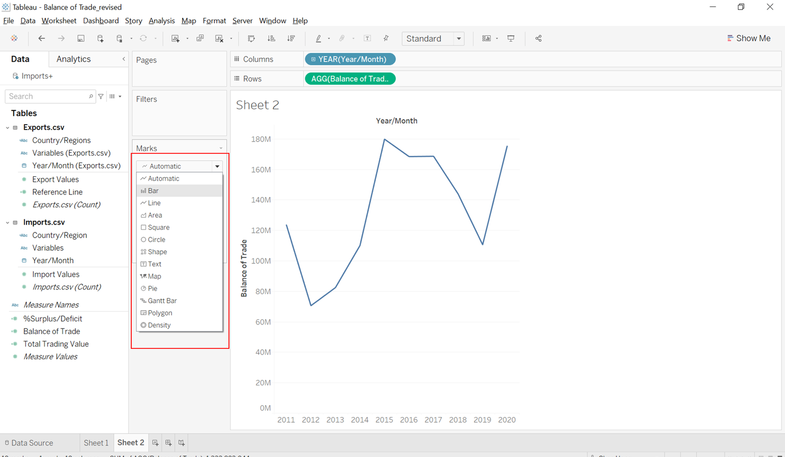

36(a). To fit into the tooltip. We will need to make the chart smaller. We will adjust the chart to the left upper side of the chart while making sure that each bar is still visible.

36(b). Next, notice that the whole year is not visible. As such, we will rotate the label. 


36(c). To further reduce the size. We will remove the **Year/Month** field label by right clicking on the field label and select **Hide Field Labels for Columns**.


37. Next, we will create a new field called **Surplus or Deficit**. This field will allow tableau to diffrentiate the difference between Surplus and Deficit. This will allow us to change the color of the bar chart later.


38(a). Next, we will drag the newly created field to color. Tableau will diffrentiate Surplus and Deficit by colour.


38(b). Notice, we are not able to change the colour for Deficit as there is no month and country selection. Tableau sum up all the trade numbers for each year.


38(c). As such, we will again drag the **Country/Regions** to the filter to allow us to select the country. We will select both **Brazil and Brunei** which show us both Surplus and Deficit numbers. Next, we will change the color of both Surplus and Deficit by clicking on the triangular button on the color legend.


38(d). Next, we will edit the colors. Click once on the **Deficit** and select a dark red colour by accessing red on the dragdown color palette. Do the same for **Surplus** by selecting a dark blue color. 

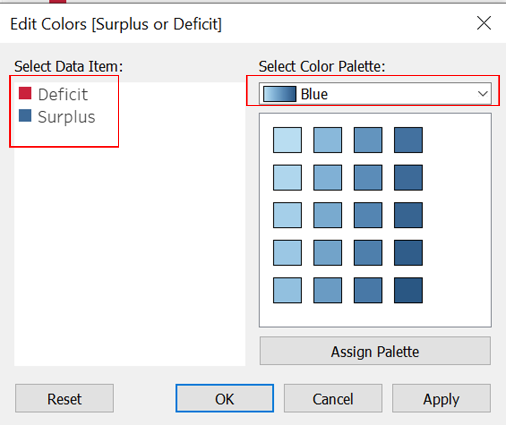

39. Once we have completed with the **Balance of Trade** chart, we will rename the chart by double clicking on the sheet tab below to **Balance of Trade (By year)**.


40(a). Next, we will switch back to **Sheet 1**. To create our tooltip, we will need a few new calculated fields. First, we will create both **%Surplus** and **%Deficit** new fields. This two fields are required to differentiate between positive percentage trade surplus and negative percentage trade deficit. Refer to both the formula below.


40(b). Next, we will create another two fields for **Surplus** and **Deficit**. These two fields will allow Tableau to differentiate between Positive Balance of Trade and Negative Balance of Trade. Refer to the two formulas below.

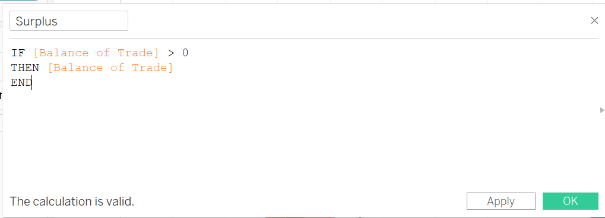


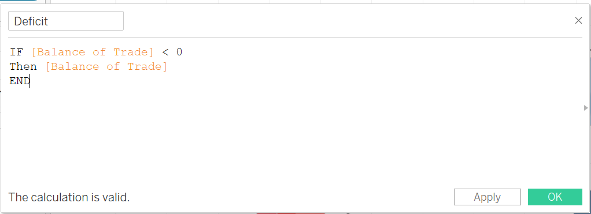

40(c). Lastly, we will crate two more fields to differentiate between the word **Surplus** and **Deficit**. Refer to the two formulas below.


41. Next, we will drag the required fields into the tooltip as shown below.


42. Thereafter, we will double click on the tooltip box and delete the whole default wordings. Then, we will input the following wordings as shown below. Note that the smaller font are in font 10 while the larger font are bold in font 14. The red and blue font is to allow tableau to differentiate between the two different fields. E.g. if the row is Surplus. The tooltip will only show the **<AGG(Surplus Blue)>,<AGG(Surplus)>> and <<SUM(%Surplus)>>** in blue and vice versa for Deficit. 


43. Remember that we have created a Balance of Trade chart previously. We will incorporate the chart into our tooltip by clicking on the **insert** button on the top left of the tooltip pop up box. We will next click the **Sheet** and select **Balance of Trade**.


44. A new line should be incorporated in the dialog box. We will change the default size of **300** to **350** to fit our bar chart into the tooltip.


45. Next, we will edit both of our import and export axis by **adding S$('1000)** to show the real representation of the chart.


46. Under the **Axis Titles**. We shall add **S$('1000)** to change the axis name. Do this for the export axis.


47(a). Next, we will incorporate two annotations to show the upper triangle of the chart as **Trade Deficit** and lower triangle as **Trade Surplus**. To do this, we will need to right click on the chart and select **Annotate**.

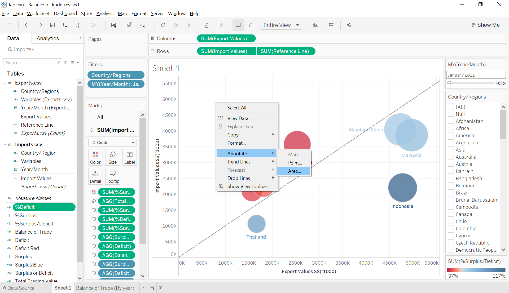

47(b). We shall add both **Trade Surplus** and **Trade Deficit** separately as shown below in our annotation dialog box.


47(c). Next, we will move both the **Trade Surplus** and **Trade Deficit** to each end of the triangle as shown below.


48. Next, if we hover our mouse to one of the markers. The tooltip will show all the whole values which is in millions and the %Surplus/Deficit in decimals. This is an inaccurate representation of the markers. First, the markers should be in billion. Second, the value should be represented with a $xxB for easier reading rather than showing whole numbers. Lastly, the percentage should be in % not decimal. As such, we will need to modify and amend our chart.

49. We will first create two new fields. These two fields will be named (Export Values S$B) and (Import Values S$B). Both fields will make use of the exisiting export and import values and mulitply each row by 1000 to show the accurate numbers. 


50. Next, we will drag the newly created fields to replace the existing fields in the columns and rows section as shown below.


51. Next, we will amend some of the existing fields by clicking on the triangular button and select edit that were affected by the change in export and import values. 


52. First, we will amend the **Balance of Trade** field by changing both export and import values to the new fields.

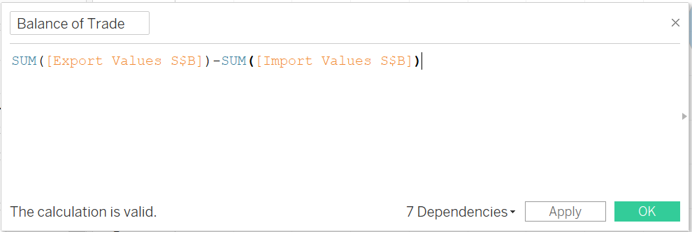

53. Next, we will also amend the Total Trading Value field.


54. Notice that the reference line has changed too as it is dependent on the export values. As such, we shall also amend the reference line formula by changing the former export value to the new field.


55. Next, we will also amend the tooltip to remove the **SGD($)('1000)** since we have change the import and export values to billions.


56(a). Next, we will drag the new import and export value fields to the tooltip and switch the existing import and export value to the new fields.


56(b). We will double click on the tooltip box and switch the existing import and export value to the new fields. Additionally, we will remove the **SGD($)('1000)**.


56(c). Thereafter, we will check the tooltip again. Notice that the value have change to billion. To ease the reader on reading the tooltip, we will format the tooltip by changing to **$B** and also change the **%Surplus/Deficit** to percentage.


57(a). To format the tooltip, we will first click on the button on the **SUM(Export Values S$B) tab under the **Marks** pane.


57(b). Next, we will format the SUM(Export Values S$B) by first clicking on the pane, then change the default numbers to Currency(Custom). Thereafter, change the Display Unit to Billions (B). Do the same for SUM(Import Values S$B).


57(c). Next, we will format **AGG(Deficit)**. As deficit is naturally a negative value. As such, we shall **Negative values** to **-$1234**. Similarly, we will change the **Display Unit** to **Billions**. Repeat the same process for **AGG(Surplus)** but no change will be needed for **Negative Values**.


57(d). Next, we will format **SUM(%Deficit)**. By changing the defualt numbers to **Percentage** and decimals to **0 places**. Repeat the same process for **SUM(%Surplus)**.


57(e). Lastly, we will format the **ATTR(Year/Month)** to the Month Year format so as to be consistent with the filter control.


58(a). Next, we will change the axis label for both import and export values. To do this, we will need to right click on the **Import Values S$B** axis and click on **Edit Axis**.


58(b). Next, the format panel will appear. Switch to the axis pane, and change the **Scale Numbers** to **Number (Custom)**. Change the **Decimal Places** to **1** and **Display Units** to **Billions (B)**. Repeat the same step for **Export Values S$B**.


59(a). Next, we will double click on the trend line to edit the trend line. The purpose for this is to remove the tooltip that is associated with the trend line.


59(b). Next, a trend line options will emerge. **Unselect** **Show tooltips** and **Show recalculated line for highlighted or selected data points**.


60. And there you have it. The first sheet has been completed. Rename the sheet to **Singapore Merchandise Trade, January 2011 - December 2020**. **Note that, the sheet name is not finalized**.  


### 4.4 Balance of Trade

61. Next, we will start to create another sheet named **Balance of Trade**. This sheet is used to analyse the relationship between **Balance of Trade** and **%Surplus/Deficit**. We will drag the **%Surplus/Deficit** to the columns section and **Balance of Trade** to the rows section.


62. Next, we will drag **Country/Regions** to detail box under **Marks** pane. A scatterplot will be formed based on countries and regions.


63. Next, notice that there are null values. Same as before, we will show the data at default position of 0. Note that there are two nulls to be place in default value of 0. 


64. Next, we will place the **Year/Month** and **Country/Regions** tab on the filter in order to filter out the selected countries. Once we have done that, click the show filter for both tabs.


65. Next, to sync selection of one sheet to be the same as another. We will switch to the **Singapore Merchandise Trade, January 2011 - December 2020** and click on the triangular button on the **Country/Regions** and **Year/Month** and go to **Apply to Worksheets** and select **All Using This Data Source**.


66. We will then go back to **Sheet 3** after our filter selection. Next, we will change our chart design to **circle** to show the bubble plot.


67. After which, we will drag the **Total Trading Value** to the **Size** box to let tableau display the size of the circle by total trading value.


68. Next, drag the **%Surplus/Deficit** to the **Color** box and edit the colors by choosing the **Red-Blue Diverging** and click the **Use Full Color Range**.


69. As the circle seems small. We will enlarge the size to the next size mark to make the markers more visible.


70. Next, we will label each marker with **Country/Regions** by dragging the **Country/Regions** to the **Label** box under the **Marks** pane.


71. Next, we will drag the fields highlighted below to the tooltip. To allow us to format required fields later. 


72. We will delete the default wordings and type down the wordings as shown below. Note that the small font is font 10 while the bigger bold font are in font 14.


73(a). Same as before, we will format the fields in the tooltip. For **AGG(Surplus)** as shown below, we will change the **Display Units** to **Billions (B)**.


73(b). As for **AGG(Deficit)**. We will change the **Negative Values** to **-$1234** and **Display Units** to **Billions (B)**.


73(c). For **SUM(%Surplus)**. We will change the to percentage with the decimal places amend to **0**.


73(d). For **ATTR(Year/Month)**. We will change the date format to **March 2001** to be consistent with our filter control.


74(a). Next, we will change our **Apply to Worksheets** tab to selected worksheets. This is to prevent the **Balance of Trade (By year)** to be sync with the rest of the selection. The Balance of Trade (By year) purpose is to display the whole 10 years in the tooltip.


74(b). We will deselect the **Balance of Trade (By year)**.


75. Once, we are done with the tooltip. We will edit the axis. Same as previously, we will right click on the Balance of Trade axis to edit axis. Remember to change to the **Axis** pane. Change the **Scale Numbers** to **Currency (Custom)** and the **Decimal Places** to **1**.


76. Next, we will change the axis for %Surplus/Deficit to **Percentage** and change the **Decimal Places** to **0**.


77. Next, we will hide the card of the **AGG(Total Trading Value)** as there is no need to refer to the size of the marker. We can check the value via the tooltips.


78. Same as before. We will adjust the transparency of the markers to 70% and select the grey color option for the border. This will make the markers more visible.


79. Next, we will make the zero lines more visible. By right clicking on the chart and select format. Go to the Lines option under the **Format Lines** tab and thicken the zero lines and choose a darker grey color as shown below.


80. Lastly, Rename the sheet to **Balance of Trade** and we have completed the design for this sheet.

### 4.5 SG Import & Export

81. We will next move to the last sheet. The purpose of the last sheet is to create a chart similar to the parallel coordinates plot to show the export and import value of a country via a line. First, we will drag the **Measure Names** and **Measure Values** to Columns and Rows respectively.


82. We will some of the fields in the **Measure Values** and retain only Export Values S$B and Import Values S$B.


83. Next, we will drag the **Country/Regions** and **Year/Month** to the filter tab.


84. We will switch back to the **Singapore Merchandise Trade, January 2011 - December 2020** and select **Sheet 4** to allow the usage of the same filter for selected worksheets.


85. Next, we will drag the **Country/Regions** to detail and **%Surplus/Deficit** to color. This will show the selected countries in the chart and also differentiate them by their %surplus or % deficit value.


86. Same as before. We will edit colors under the color legend to **Red-Blue Diverging** and select **Use Full Color Range**. This will allow the same colors to be use throughout the different sheets.


87. Next, we will drag the **Country/Regions** to label to label the countries in the chart.


88. Next, we will drag the fields as shown below into the tooltip.


89. We will change the tooltip wordings to the wordings as shown below to display useful information such as the export values and import values. 


90. Next, we will format the axis by right clicking on the **Value** axis and change the **Scale Numbers** to **Currency (Custom)**, **Decimal Places** to **1** and **Display Units** to **Billions (B)**.


91. Next, we will format the **SUM(%Surplus/Deficit)** to **Percentage** and **Decimal Places** to **0**.


92. Notice that the direction for export and import values are wrong. It should be blue when export values are higher than import value. To amend this, we shall change the position of the SUM(Export Values S$B) and SUM(Import Values S$B) in the **Measure Values** pane.


93. Next, we will rename the Import Values S$B and Export Values S$B to **Import** and **Export** since the y-axis is already labelled as **Values**.


94. Next, we will input the dots on the end of the line by clicking on the **Color** box and selecting the line with dots.


95. Lastly, we will change the size of the line to a bit larger to make the lines more visible. We will also rename the sheet name to **Import & Export (By Countries)**


### 4.6 Dashboard

96. Now, we will combined all the charts together in a dashboard. We will open a new dashboard by clicking on the dashboard icon beside the new sheet tab. Next, we will change the **Screen Size** to **Automatic** to allow tableau to automatically fit the screen.

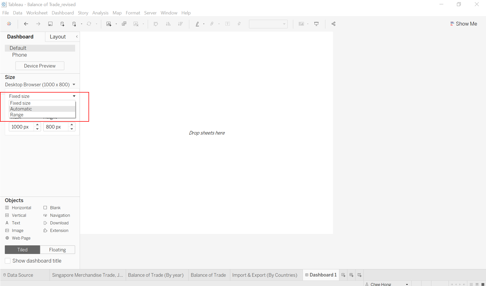

97. Next, we will move the sheets to its desired location as shown below. We will also rename the first sheet, **Singapore Merchandise Trade, January 2011 - December 2020** to **Singapore Merchandise Trade, Jan 2011 - Dec 2020** so that the title will not need to end on the second line.


98. To allow interactivity where the user select one marker, the same marker from the other sheets will be highlighted as well. We will go to the **Actions** under the **Worksheet** tab.


99. Under the **Add Action** tab, select **Highlight**.

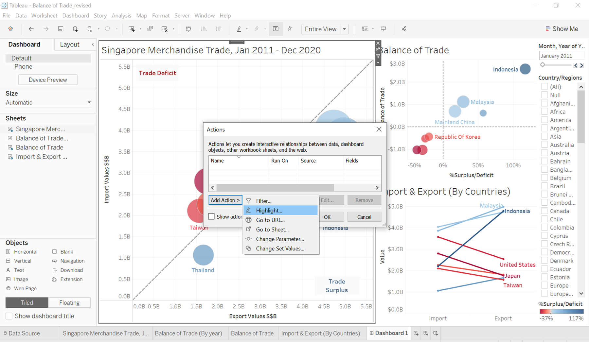

100. Next, under the **Source Sheets** and **Target Sheets**, select **Dashboard 1** for both options to allow all sheets to interact with each other.


101. Next, we will rename the first sheet to allow the month to change based on the user selection.

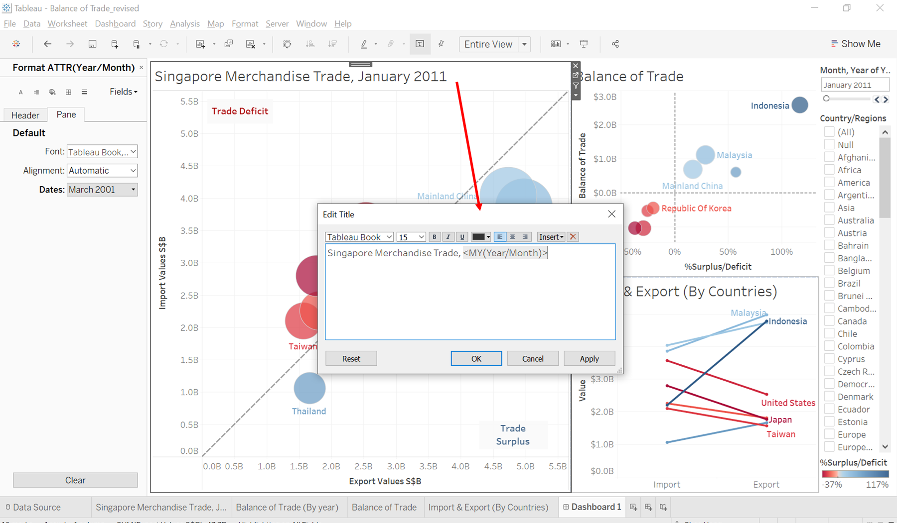

102. We will do the same for both **Balance of Trade** and **Import & Export (By Country)**. For **Import and Export (By Country)**, we will additionally add a SG on the front and remove (By Country) at the back.


103. Next, we will add a caption below the dashboard. First, we will select the text object and drag it to the middle bottom of the chart until the bottom portion is shaded. 


104. A dialog box will pop up. We will type down the source and dataset in the caption.


105. Next, we will drag the text object all the way down to the bottom of the page. 


106. Next, we will incorporate **Animations** to the chart so that users can see the movement of the markers more fluidly and interactively.


107. On the Animations pane. We will select **On** and also change the **Duration** to **1.00 seconds** to make the movement time just right.


108. Lastly, we will incorporate a dashboard name. Select the **Show Dashboard Title** at the bottom left of the screen and type **Singapore Merchandise Trade, Janurary 2011 - December 2020** with bold letters.


109. Lastly, we will remove the **%Surplus/Deficit** of the color legend and enlarge the **Country/Regions** selection a bit to allow more visibility of the countries.


110. The dashboard will be publish in Tableau Public. Usually, there will be some differences between Tableau Desktop and Tableau Public. In our case, the markers are too big as shown below.


111. As such, we will minimize the size for both the **Singapore Merchandise Trade** and **Balance of Trade**


112. We will also add a caption to give some insights to the users using the visualisation. The caption will share about Taiwan increasing trade deficit and also Thailand increasing trade surplus. This will be articulated more in section 5.0 below.


113. The finalized visualisation will looks like this in Tableau Public. Access the link [here] (https://public.tableau.com/app/profile/chee.hong/viz/SingaporeMerchandiseTradeJan2011-Dec2020/Dashboard1) 

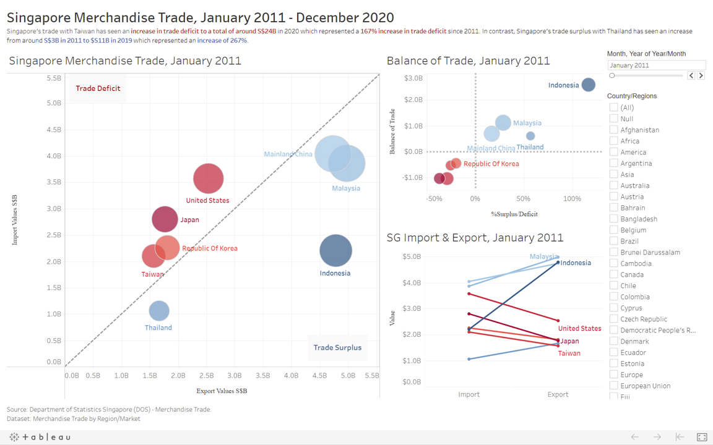

# 5.0 Observations from the data visualisation

1) Singapore's Balance of Trade with Indonesia has been decreasing from year of 2011 to 2020. In 2011, the Balance of Trade exceeded S$30B. In October 2011, the Balance of Trade hit a record 172% trade surplus. However, the Balance of Trade has been decreasing to around S$10B in 2020 possibly due to the impact of Covid-19. This is with an exception of 2018 where there is an increase in Balance of Trade between Indonesia to around S$23B. However, Indonesia remains among one of the highest trade partners of Singapore in terms of Balance of Trade.


2) In contrast, Singapore's Balance of Trade with United States although has been in the red from 2011 to 2019 with the lowest %deficit of -56% recorded in November 2011. The Balance of trade has been increasing slowly where it reaches a positive Balance of Trade of around S$5B in 2020 from a low of around -S$22B in 2011, 2012 and 2014. In 2020, the highest recorded Balance of Trade with the US is S$2.12B which represented 56% of trade surplus. See below two images for more info.


3)Singapore's trade with Taiwan has seen an increase in Trade Deficit from 2011 of around S$9B to 2020 of around S$24B. Singapore has not experience any Trade Surplus from trade with Taiwan within this 10 years. The largest percentage deficit recorded for trade with Taiwan is on May 2019 where the Balance of Trade is -S$2.36B which resulted in a 60% of trade deficit. Although Singapore balance of trade with taiwan has been increasing. There is a decrease from 2015 to 2016 where it starts to increase again in 2017.


4(a) Singapore's balance of trade with Malaysia has been decreasing since 2011 of S$14B to 2020 -$12B. Singapore experience a trade surplus from 2011 to 2018 where this has since change to trade deficit from 2019 to 2020. The interesting to note is from 2019 to 2020. There is a sharp increase of 1100% in trade deficit, from S-$1B to S$12B. This might be due to increase imports for daily necessities from Malaysia during the COVID-19 period whereas export to Malaysia has since slow down due to the border restrictions between the two countries. 

4(b) The lowest trade deficit with Malaysia is in June 2020 where there is a -S$1.58B of trade deficit which accounted to a 30% of deficit


5) Singapore's trade with Thailand has seen an increase since 2011 to 2019. However, there is a sharp drop in 2020. This sharp drop might be due to COVID-19 situation where factory output might have an impact to the trade from both side. The highest trade surplus percentage was recorded in November 2019 where there is a 182% surplus which amounted to $1.35B. 


